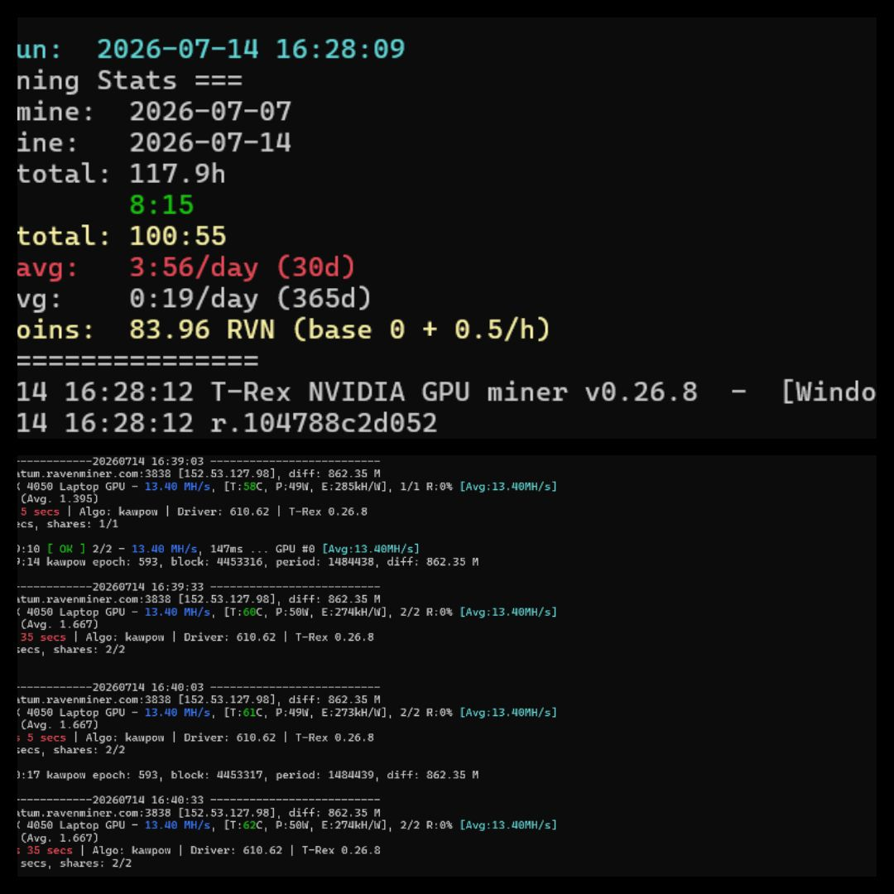

# RVN Mining Tracker v1.0.0

A lightweight Python wrapper around [t-rex miner](https://github.com/trexminer/T-Rex) for mining Ravencoin (RVN). It colorizes the miner's console output (hashrate, uptime, OK/FAIL, temperature), tracks mining sessions in a local CSV log, and shows running stats (today / 7-day / month / year totals plus an estimated coin total) every time it starts.

> **Note:** Coin totals are a local estimate only (based on a fixed RVN/hour rate), not a live balance pulled from the pool.

## Features

- **Session Tracking** — automatically records the start/end time of every mining session
- **Crash Recovery** — if the script is killed unexpectedly, the in-progress session is recovered and saved on next run
- **Mining Statistics** — today / 7-day / month / year totals, shown on every startup and exit
- **Colored Console Output** — hashrate, uptime, OK/FAIL, and temperature are highlighted for readability
- **CSV History** — every session is logged to `Mining_History.csv` for your own records
- **Estimated Coin Counter** — running estimate of RVN earned, based on a configurable RVN/hour rate
- **Average Session Hashrate** — live running average shown in the console and window title

## Screenshot

Startup stats summary:



Live colorized miner output:


## Requirements

- **Python 3.8 or newer** must be installed on your system beforehand ([python.org/downloads](https://www.python.org/downloads/)). During installation, make sure to check **"Add Python to PATH"**.
- No external Python packages are required (see `requirements.txt`) — only the standard library.
- **[t-rex miner](https://github.com/trexminer/T-Rex)** (`t-rex.exe`) — the actual RVN mining engine this script controls. Download it separately and place it as described below.
- Windows (uses ANSI console codes and a Windows-style console title; runs in cmd.exe / Windows Terminal).

## Folder structure

All of the following files **must be in the same folder**:

```
your-folder/
├── RVN_Mining_Tracker_v1.0.0.py   <- the tracker script
├── start_rvn3838.bat              <- double-click this to run
└── t-rex.exe                      <- the mining engine (download separately)
```

The script will also create `Mining_History.csv`, `Session.tmp`, and `Error_Log.txt` in this same folder the first time it runs — this happens automatically, no manual setup needed for those.

## Setup

1. Install Python (see Requirements above) if you don't already have it.
2. Download `t-rex.exe` and place it in the folder alongside the script and the `.bat` file.
3. Open `RVN_Mining_Tracker_v1.0.0.py` in a text editor and find this line near the top:

   ```python
   TREX="t-rex.exe";POOL="stratum+tcp://stratum.ravenminer.com:3838";WALLET="YOUR_RVN_WALLET.Worker1";ALGO="kawpow"
   ```

4. Replace `YOUR_RVN_WALLET.Worker1` with your own RVN wallet address, keeping the `.WorkerName` suffix (this is how most pools identify individual rigs), e.g.:

   ```python
   WALLET="RYourActualWalletAddressHere.Worker1"
   ```

5. (Optional) Change `POOL` if you want to mine on a different Ravencoin pool, or `COIN_RATE` if you want a different RVN/hour estimate for the stats display.

## Usage

Just double-click **`start_rvn3838.bat`**. It will:
- Launch the tracker script, which in turn starts `t-rex.exe` with your pool/wallet settings
- Print colorized live output from the miner
- Log each mining session's duration and estimated coins to `Mining_History.csv`
- Show a stats summary on startup and on exit (closing the window with Ctrl+C also triggers a clean save + summary)

Alternatively, you can run it directly from a terminal in the folder:

```
python RVN_Mining_Tracker_v1.0.0.py
```

## Files created at runtime

These are local, per-machine data files and are excluded via `.gitignore`:

- `Mining_History.csv` — session history log
- `Session.tmp` — autosave file used to recover an in-progress session if the script is killed unexpectedly
- `Error_Log.txt` — error/traceback log

## License

MIT License — Copyright (c) 2026 ElijahLab. See [LICENSE](LICENSE) for the full text.
