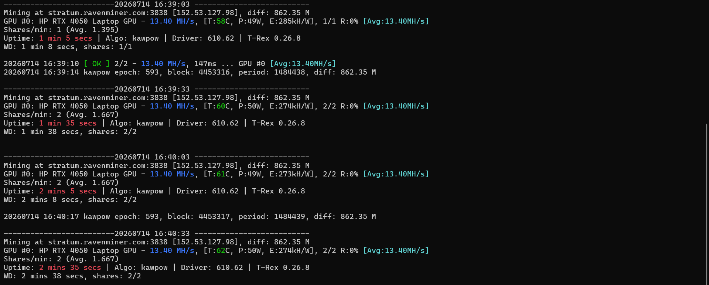
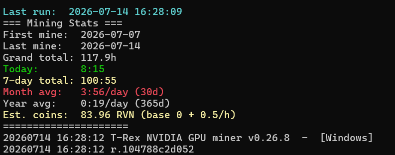

# RVN Mining Tracker

A lightweight Python wrapper around [T-Rex Miner](https://github.com/trexminer/T-Rex) for mining Ravencoin (RVN). It launches the miner for you, colorizes its console output (hashrate, uptime, OK/FAIL, temperature), tracks every mining session in a local CSV log, and prints a running stats summary (today / 7-day / month / year totals plus an estimated coin total) every time it starts and stops.

> **Note:** Coin totals are a local estimate only (session duration × a fixed RVN/hour rate), not a live balance pulled from the pool.

## Features

- **One-click start** — a single double-click launches the miner, no manual commands needed
- **Session Tracking** — automatically records the start/end time and duration of every mining session
- **Crash Recovery** — if the script is killed unexpectedly (power loss, crash, etc.), the in-progress session is recovered and saved on the next run instead of being lost
- **Mining Statistics** — today / 7-day / month / year totals, printed on every startup and every exit
- **Colored Console Output** — hashrate, uptime, `[ OK ]` / `[FAIL]` shares, and GPU temperature are highlighted for readability
- **CSV History** — every session is logged to `Mining_History.csv`, so you keep your own full mining history
- **Estimated Coin Counter** — a running estimate of RVN earned, based on a configurable RVN/hour rate
- **Average Session Hashrate** — a live running average shown both in the console and in the window title bar

## How it works

`RVN_Mining_Tracker.py` is a thin wrapper: it starts `t-rex.exe` as a subprocess with the pool/wallet/algorithm configured at the top of the script, then reads and re-prints the miner's output line by line, adding colors and a running average hashrate. The moment it sees the miner report `"Mining at ..."`, it records a session start time. When the script exits — normally, via Ctrl+C, or because the window was closed — it records the session end time, appends a row to `Mining_History.csv` (date, start, end, duration, estimated coins), and prints an updated stats summary.

Every 30 seconds while mining, the current session's progress is also written to `Session.tmp`. If the process is ever killed abruptly without a clean shutdown, that file lets the next run recover and save the lost session instead of discarding it.

## Screenshots

Live colorized miner output:



Startup/exit stats summary:



## Requirements

- **Python 3.8 or newer**, installed on your system beforehand ([python.org/downloads](https://www.python.org/downloads/)). During installation, make sure to check **"Add Python to PATH"** — this is also what registers `.py` files to run with Python when you double-click them.
- No external Python packages are required (see `requirements.txt`) — only the standard library.
- **[T-Rex Miner](https://github.com/trexminer/T-Rex)** (`t-rex.exe`) — the actual RVN mining engine this script controls. Download it separately and place it as described below.
- Windows (uses ANSI console codes and a Windows-style console title; runs in cmd.exe / Windows Terminal).

## Folder structure

All of the following files **must be in the same folder**:

```
your-folder/
├── RVN_Mining_Tracker.py   <- the tracker script - double-click this to run
├── start_rvn3838.bat       <- alternative way to run it (see Usage)
└── t-rex.exe               <- the mining engine (download separately)
```

The script will also create `Mining_History.csv`, `Session.tmp`, and `Error_Log.txt` in this same folder the first time it runs — this happens automatically, no manual setup needed for those.

## Setup

1. Install Python (see Requirements above) if you don't already have it.
2. Download `t-rex.exe` and place it in the folder alongside `RVN_Mining_Tracker.py` and `start_rvn3838.bat`.
3. Open `RVN_Mining_Tracker.py` in a text editor and find this line near the top:

   ```python
   WALLET="RMiEA9wNM5Bc3vrmqjxAKPxFa1B29mVYmW.test";ALGO="kawpow"
   ```

4. Replace `RMiEA9wNM5Bc3vrmqjxAKPxFa1B29mVYmW` with your own RVN wallet address, keeping the `.WorkerName` suffix (this is how most pools identify individual rigs), e.g.:

   ```python
   WALLET="RYourActualWalletAddressHere.rig1"
   ```

5. (Optional) Change `POOL` if you want to mine on a different Ravencoin pool, or `COIN_RATE` if you want a different RVN/hour estimate for the stats display.

## Usage

**Double-click `RVN_Mining_Tracker.py`.** That's it — this starts the tracker, which in turn launches `t-rex.exe` with the pool/wallet settings from the script, shows colorized live output, and starts logging the session.

Alternatively, you can double-click `start_rvn3838.bat` or run either of these directly from a terminal in the folder — both start the same tracker script and behave identically:

```
python RVN_Mining_Tracker.py
```

While running, it will:
- Launch `t-rex.exe` with your pool/wallet settings
- Print colorized live output from the miner
- Log each mining session's duration and estimated coins to `Mining_History.csv`
- Show a stats summary on startup and on exit (closing the window or pressing Ctrl+C also triggers a clean save + summary)

## Files created at runtime

These are local, per-machine data files and are excluded via `.gitignore`:

- `Mining_History.csv` — session history log
- `Session.tmp` — autosave file used to recover an in-progress session if the script is killed unexpectedly
- `Error_Log.txt` — error/traceback log

## License

MIT License — Copyright (c) 2026 ElijahLab. See [LICENSE](LICENSE) for the full text.

---

## ⚠️ Important: replace the test wallet address

The RVN wallet address currently set in `RVN_Mining_Tracker.py` (`RMiEA9wNM5Bc3vrmqjxAKPxFa1B29mVYmW`) is provided **for testing only**, so you can confirm the project runs correctly out of the box. Any RVN mined while using it goes to that test address, **not to you**.

Once you've verified everything works, open `RVN_Mining_Tracker.py` and replace the `WALLET` value with your own RVN wallet address (see Setup, step 3–4 above) before mining for real.
